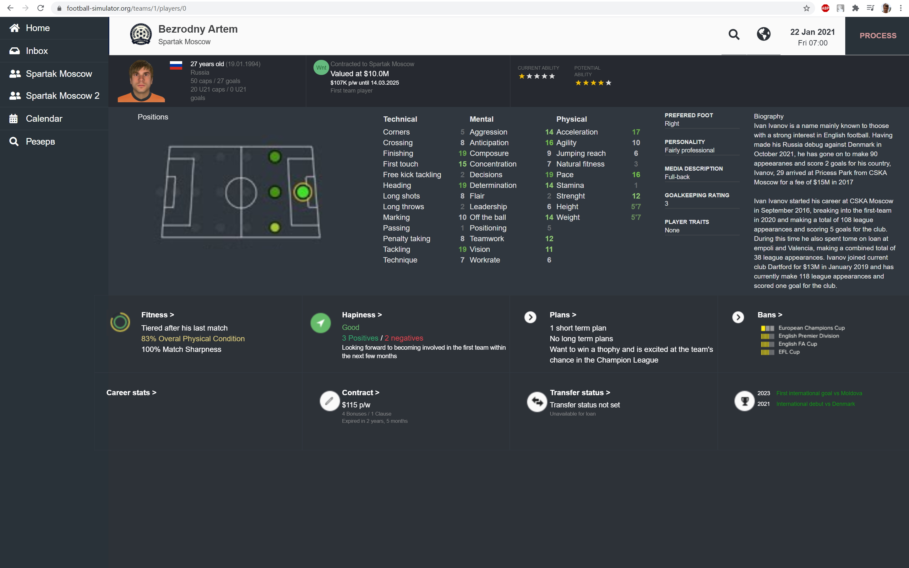
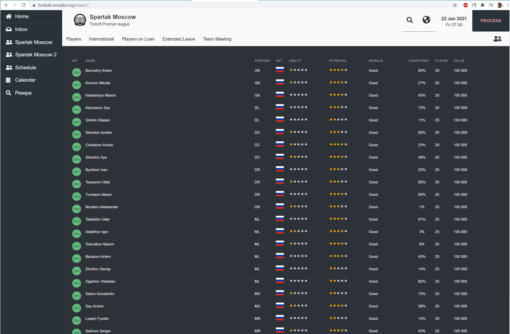
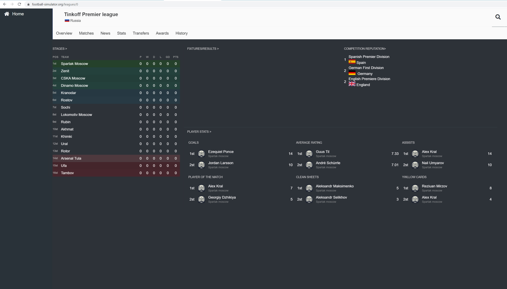

# Open Football

[](http://drone.zoxexivo.com/ZOXEXIVO/open-football)

Attempt to implement Sigames Football Manager simulation engine without manual control.

**[open-football.org](https://open-football.org)**

The project is a simulation of soccer leagues and clubs, including match simulation.

The project is NOT a game, it is a simulation without the possibility of control.

The goal is to get as close as possible to a real soccer simulation and based on this data:

- Predict match results
- Predict the success of player transfers
  Example: send Kylian Mbappé to Italian Bari and run simulation for 5 years and watch results

What do I need to do?
1) Make a simulation of the match
2) Simulate the rest of soccer activities (training, transfers, etc.)
3) Change the synthetic player database to a real one and run the simulation.
4) Use the simulation

Currently available nation for simulation - **Russia**, **Italy**, **England**

#### How to run?

1) Local run

```console
// run frontend (Angular)
cd ui
npm install --force
npm start
...
// run backend
cargo run
...
open chrome at http://localhost:18000
```

2) Run in Docker

```console
cd open-football
docker build -f .\build\Football.Dockerfile -t open-football .
docker run -d -p 18000:18000 --name open-football open-football

open chrome at http://localhost:18000
```

[Match page example (click on any goals)](https://open-football.org/leagues/english-premier-league)


[Player page example (click on any player)](https://open-football.org/teams/juventus)


[Club page example](https://open-football.org/teams/juventus)



[League page example](https://open-football.org/leagues/italian-serie-a)



### License

Apache License 2.0